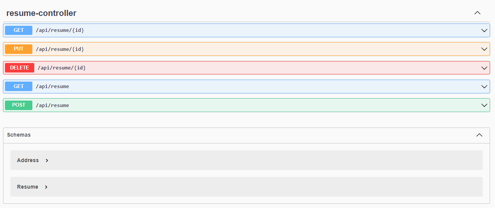
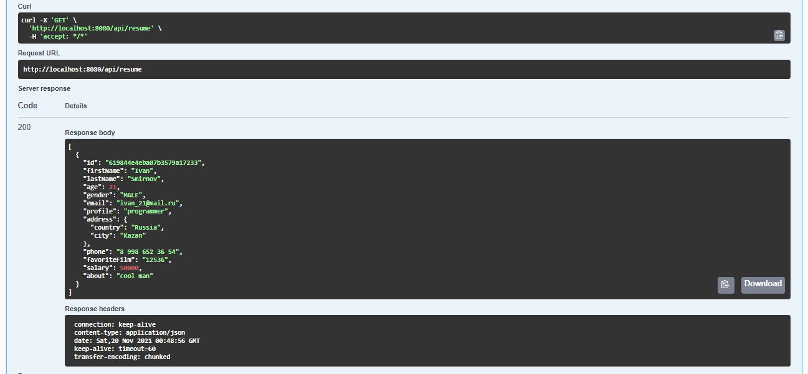

#2 Spring Boot Application + MongoDB + Docker compile
---
How get start?

- docker build -t spring_rest_api .
- docker-compose build
- docker-compose up
---

Simple rest application for working with resume

---
How see api?

http://localhost:8080/swagger-ui.html

